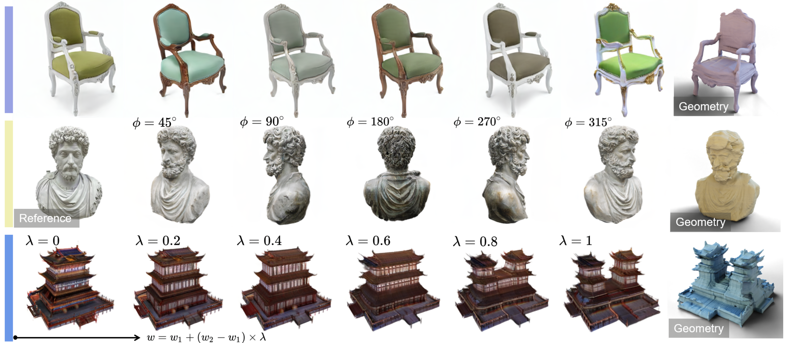
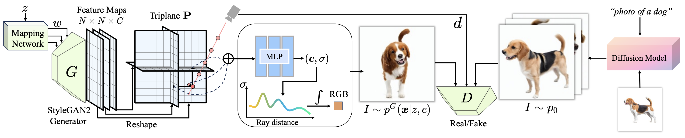

# CAD: Photorealistic 3D Generation via Adversarial Distillation

### [Project Page](http://raywzy.com/CAD/) | [Paper (ArXiv)](https://arxiv.org/abs/2312.06663) | [Supplemental Material]()

**This repository will contain the official implementation of arXiv paper, *CAD: Photorealistic 3D Generation via Adversarial Distillation*.**

[Ziyu Wan](http://raywzy.com/)1,2,
[Despoina Paschalidou](https://paschalidoud.github.io/)2,
[Ian Huang](https://ianhuang0630.github.io/)2,
[Hongyu Liu](https://kumapowerliu.github.io/)3,
[Bokui Shen](https://cs.stanford.edu/people/bshen88/)2,
[Xiaoyu Xiang](https://engineering.purdue.edu/people/xiaoyu.xiang.1),
[Jing Liao](https://liaojing.github.io/html/index.html)1,
[Leonidas Guibas](https://geometry.stanford.edu/member/guibas/)2  
1City University of Hong Kong, 2Stanford University, 3HKUST

## :star2: Pipeline

